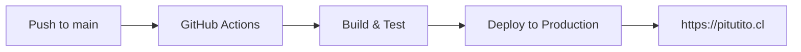

# 📚 Documentación - Pitutito.cl

## 🎯 Índice de Documentación

### **🚀 Deployment y DevOps**
- [`DEPLOYMENT_COMPLETO.md`](./DEPLOYMENT_COMPLETO.md) - **Sistema completo de deployment automatizado**
- [`PREVIEW_DEPLOYMENTS.md`](./PREVIEW_DEPLOYMENTS.md) - **Preview deployments para ramas de desarrollo**
- [`GITHUB_ACTIONS_SETUP.md`](./GITHUB_ACTIONS_SETUP.md) - **Configuración inicial de GitHub Actions**
- [`MULTI_APP_DEPLOYMENT.md`](./MULTI_APP_DEPLOYMENT.md) - **Arquitectura para múltiples aplicaciones**
- [`SCRIPTS_SETUP.md`](./SCRIPTS_SETUP.md) - **Scripts de configuración y mantenimiento**

### **🏗️ Arquitectura y Configuración**
- [`DESPLIEGUE.md`](./DESPLIEGUE.md) - **Guía de despliegue original (legacy)**
- [`AUTOALOJAMIENTO_SUPABASE.md`](./AUTOALOJAMIENTO_SUPABASE.md) - **Configuración de Supabase**
- [`CONFIGURACION_DOMINIO_CLOUDFLARE.md`](./CONFIGURACION_DOMINIO_CLOUDFLARE.md) - **Setup de DNS**
- [`ARQUITECTURA_Y_ESCALABILIDAD.md`](./ARQUITECTURA_Y_ESCALABILIDAD.md) - **Planificación arquitectónica**

### **🔧 Configuración Técnica**
- [`USO_DE_DOCKER.md`](./USO_DE_DOCKER.md) - **Docker y containerización**
- [`CONFIGURACION_DOCKER_MULTI_PROYECTO.md`](./CONFIGURACION_DOCKER_MULTI_PROYECTO.md) - **Docker multi-proyecto**
- [`VERIFICACION_SUPABASE.md`](./VERIFICACION_SUPABASE.md) - **Testing de Supabase**

### **🌐 DNS y Dominios**
- [`INSTRUCCIONES_CONFIGURACION_DNS.md`](./INSTRUCCIONES_CONFIGURACION_DNS.md) - **Configuración general de DNS**
- [`INSTRUCCIONES_DNS_NIC_CHILE.md`](./INSTRUCCIONES_DNS_NIC_CHILE.md) - **Específico para NIC Chile**

### **💰 Análisis y Planificación**
- [`ANALISIS_DE_COSTOS.md`](./ANALISIS_DE_COSTOS.md) - **Análisis de costos de infraestructura**
- [`ACCESO_AL_SERVIDOR.md`](./ACCESO_AL_SERVIDOR.md) - **Configuración de acceso al VPS**

---

## 🚀 Guías Rápidas

### **Para Developers**
1. **Setup inicial**: [`GITHUB_ACTIONS_SETUP.md`](./GITHUB_ACTIONS_SETUP.md)
2. **Preview deployments**: [`PREVIEW_DEPLOYMENTS.md`](./PREVIEW_DEPLOYMENTS.md)
3. **Sistema completo**: [`DEPLOYMENT_COMPLETO.md`](./DEPLOYMENT_COMPLETO.md)

### **Para DevOps**
1. **Multi-aplicaciones**: [`MULTI_APP_DEPLOYMENT.md`](./MULTI_APP_DEPLOYMENT.md)
2. **Scripts disponibles**: [`SCRIPTS_SETUP.md`](./SCRIPTS_SETUP.md)
3. **Arquitectura**: [`ARQUITECTURA_Y_ESCALABILIDAD.md`](./ARQUITECTURA_Y_ESCALABILIDAD.md)

### **Para Administradores**
1. **Costos**: [`ANALISIS_DE_COSTOS.md`](./ANALISIS_DE_COSTOS.md)
2. **DNS**: [`CONFIGURACION_DOMINIO_CLOUDFLARE.md`](./CONFIGURACION_DOMINIO_CLOUDFLARE.md)
3. **Acceso**: [`ACCESO_AL_SERVIDOR.md`](./ACCESO_AL_SERVIDOR.md)

---

## 🎯 Flujos Principales

### **🔄 Deployment Flow**

### **🔍 Preview Flow**

---

## 📊 Estado Actual

| Componente | Estado | Documentación |
|------------|--------|---------------|
| **Deployment Main** | ✅ Activo | [`DEPLOYMENT_COMPLETO.md`](./DEPLOYMENT_COMPLETO.md) |
| **Preview Deployments** | ✅ Activo | [`PREVIEW_DEPLOYMENTS.md`](./PREVIEW_DEPLOYMENTS.md) |
| **Multi-App Support** | ✅ Configurado | [`MULTI_APP_DEPLOYMENT.md`](./MULTI_APP_DEPLOYMENT.md) |
| **SSL Automation** | ✅ Activo | [`GITHUB_ACTIONS_SETUP.md`](./GITHUB_ACTIONS_SETUP.md) |
| **Auto Cleanup** | ✅ Activo | [`PREVIEW_DEPLOYMENTS.md`](./PREVIEW_DEPLOYMENTS.md) |

---

## 🆘 Soporte Rápido

### **Problemas Comunes**
- **Deployment falla**: Ver logs en GitHub Actions
- **Preview no carga**: Verificar SSL y DNS propagation
- **Variables faltantes**: Ejecutar `./setup-env-production.sh`

### **Contacto**
- **Email**: gabriel@pantoja.cl
- **Repositorio**: https://github.com/gabrielpantoja-cl/pituto-vecino-confiable

---

**📚 Documentación actualizada:** $(date)  
**🚀 Sistema completamente funcional para desarrollo colaborativo**